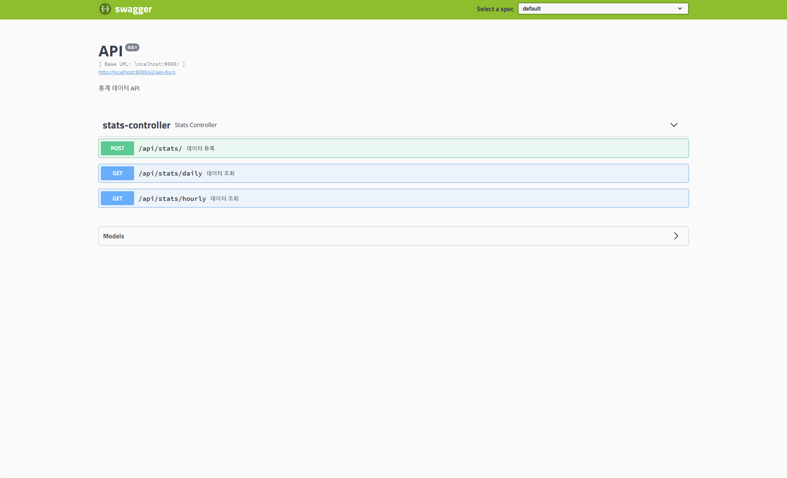

<div align="center">
  <h1>통계 웹 애플리케이션</h1>
</div>

<div align="center">
  
  
  
  
</div>
<br>

<div align="left">
  <h2>1. 개발 환경</h2>

- <p><b>OS: </b>Windows (10, 64 Bit)</p>
- <p><b>DB: </b>H2</p>
- <p><b>IDE: </b>IntelliJ</p>
</div>
<br>

<div align="left">
  <h2>2. 실행 화면</h2>


</div>
<br>

<div align="left">
  <h2>3. 디렉터리 구조</h2>

  ```
  *
  ├─ app.stats.domain/**: 도메인 및 서비스 클래스
  ├─ app.stats.application/**: 컨트롤러 및 공통 클래스
  │
  ├─ src/resources/**: 설정 파일 및 데이터 파일
  └─ src/test/**: 서비스 로직 단위 테스트
  ```
</div>
<br>

<div align="left">
  <h2>4. 구현 기능</h2>

#### 1) 데이터 등록 (`POST, /api/stats/`)
- /src/resources 디렉터리에 있는 2020-01-02 ~ 2020-01-05 파일을 등록한다.

  ```
  각 파일은 일자/시간별 광고 요청, 응답, 클릭 횟수가 기록된다.
  - new 파일은 특정 날짜/시간(0시 ~ 23시)의 횟수가 기록된 파일이다.
  - update 파일은 특정 날짜/시간(0시 ~ 23시)의 횟수가 일부 수정된 파일이다.
  - invalid 파일은 특정 시간의 횟수 값이 누락된 파일로 오류가 발생하는 파일이다.
  ```
#### 2-1) 날짜별 데이터 조회 (`GET, /api/stats/daily`)
- 특정 날짜의 광고 요청(request), 응답(response), 클릭(click) 합계 횟수를 보여준다.
#### 2-2) 날짜/시간별 데이터 조회 (`GET, /api/stats/hourly`)
- 특정 날짜/시간의 광고 요청(request), 응답(response), 클릭(click) 횟수를 보여준다.
</div>
<br>